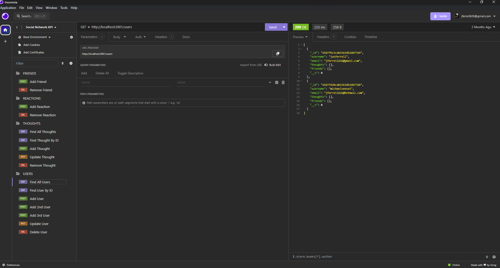
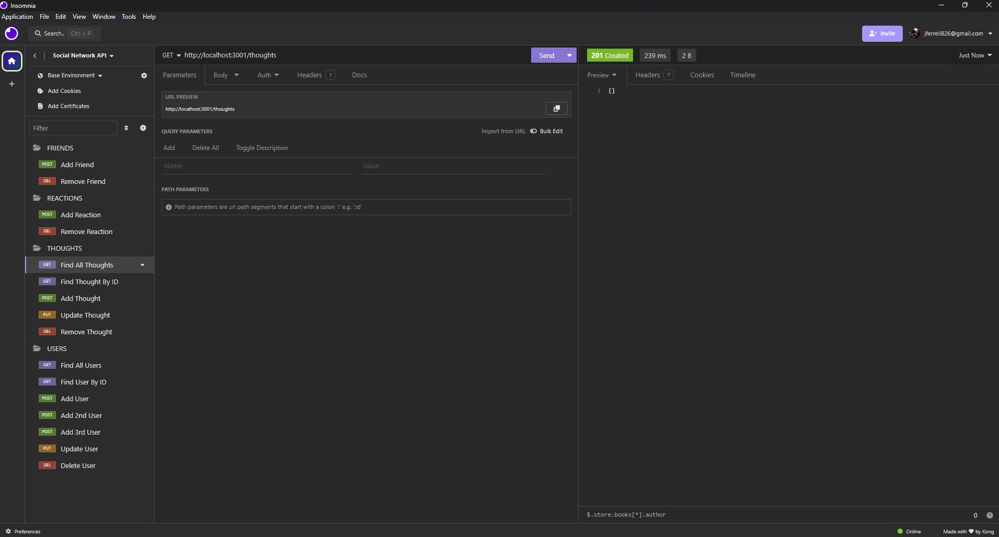

# Matsu Social Network API


## Overview


Bootcamp challenge to build a NoSQL (Mongo) API for a social network web application where users can share their thoughts, react to friends’ thoughts, and create a friend list.

## Getting Started

To get a local copy up and running, follow these simple steps:

1. Clone the repository to your local machine:
   ```sh
   git clone https://github.com/lifeofmatsu/Book-Search-Engine.git
   cd Book-Search-Engine

## Installation
- run `npm install`
- run `npm start`

## Usage


Use `insomnia` or `postman` execute the api calls to achieve the following:

REACTIONS:
- Create Reaction
- Delete Reaction

THOUGHTS:
- Get all Thoughts
- Get Single Thought by ID
- Create Thought
- Update Thought
- Delete Thought

USERS:
- Get all Users
- Get Single User by ID
- Create User
- Update User
- Delete User
- Add Friend
- Delete Friend




## License

[](./LICENSE)

Distributed under the MIT License. See `LICENSE` for more information.

## Contact

**Justin (Jus) Ferrell**

- Email: [jferrell826@gmail.com](jferrell826@gmail.com)
- LinkedIn: [https://www.linkedin.com/in/lifeofmatsu/](https://www.linkedin.com/in/lifeofmatsu/)

- Project Link: [https://github.com/lifeofmatsu/matsu-social-network.git](https://github.com/lifeofmatsu/matsu-social-network.git)

## Acknowledgments

- **Badges:** [Alexandre Sanlim](https://github.com/alexandresanlim/Badges4-README.md-Profile)
